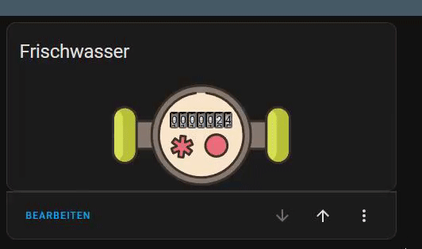

# Fluid Flow Card by [@Gamer08YT](https://www.github.com/Gamer08YT)

[](https://my.home-assistant.io/redirect/hacs_repository/?owner=Gamer08YT&repository=hass-fluid-flow&category=frontend) ![Project Maintenance][maintenance-shield]



## Todo / Planned:
- Add better Meter Image (Real 2D Image of a Water Meter)
- Optimize Animations

## Configuration

A graphical user interface (GUI) to configure the card is currently not available.

After installation, simply press "Add Card", search for "Fluid Flow Card", and add the card.

## Options

| Name  | Type   | Requirement  | Description                   | Default    |
|-------|--------|--------------|-------------------------------|------------|
| type  | string | **Required** | `custom:hass-fluid-flow-card` |            |
| title | string | Optional     | Title of Card                 | Tank Level |

### Example configuration

```yaml
type: custom:hass-fluid-flow-card
entity: sensor.waterflow
```

## Install

### HACS

*This repo is available for install through the HACS.*

* Go to HACS → Frontend
* Use the FAB "Explore and download repositories" to search "Fluid Flow Card".

_or_

Click here:

[](https://my.home-assistant.io/redirect/hacs_repository/?owner=Gamer08YT&repository=hass-fluid-flow&category=frontend)

## Sources:

### Images:

Water Meter (Icons8):

https://icons8.de/icon/8YvXLPxQ51Vm/water-meter

### Libs:

analog-counter-wheel (Code was converted by me to Typescript, some slight changes in Code and CSS):

https://github.com/victornpb/analog-counter-wheel

[commits]: https://github.com/Gamer08YT/hass-fluid-flow/commits/main

[maintenance-shield]: https://img.shields.io/maintenance/yes/2023.svg?style=for-the-badge

[releases]: https://github.com/Gamer08YT/hass-fluid-flow/releases